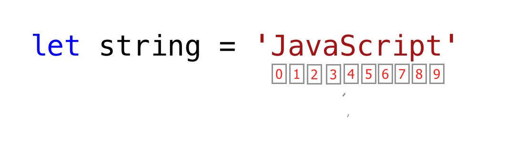

<div align="center">
  <h1> 30 Days Of JavaScript: أنواع البيانات</h1>
  <a class="header-badge" target="_blank" href="https://www.linkedin.com/in/asabeneh/">
  
  </a>
  <a class="header-badge" target="_blank" href="https://twitter.com/Asabeneh">
  
  </a>

  <sub>مؤلف:
  <a href="https://www.linkedin.com/in/asabeneh/" target="_blank">Asabeneh Yetayeh</a><br>
  <small> يناير, 2020</small>
  </sub>
</div>
</div>

[<< اليوم 1](../readMe.md) | [اليوم 3 >>](../03_Day_Booleans_operators_date/03_booleans_operators_date.md)


- [📔 اليوم 2](#-day-2)
	- [Data Types](#data-types)
		- [Primitive Data Types](#primitive-data-types)
		- [Non-Primitive Data Types](#non-primitive-data-types)
	- [Numbers](#numbers)
		- [Declaring Number Data Types](#declaring-number-data-types)
		- [Math Object](#math-object)
			- [Random Number Generator](#random-number-generator)
	- [Strings](#strings)
		- [String Concatenation](#string-concatenation)
			- [Concatenating Using Addition Operator](#concatenating-using-addition-operator)
			- [Long Literal Strings](#long-literal-strings)
			- [Escape Sequences in Strings](#escape-sequences-in-strings)
			- [Template Literals (Template Strings)](#template-literals-template-strings)
		- [String Methods](#string-methods)
	- [Checking Data Types and Casting](#checking-data-types-and-casting)
		- [Checking Data Types](#checking-data-types)
		- [Changing Data Type (Casting)](#changing-data-type-casting)
			- [String to Int](#string-to-int)
			- [String to Float](#string-to-float)
			- [Float to Int](#float-to-int)
	- [💻 Day 2: Exercises](#-day-2-exercises)
		- [Exercise: Level 1](#exercise-level-1)
		- [Exercise: Level 2](#exercise-level-2)
		- [Exercises: Level 3](#exercises-level-3)

# 📔 Day 2

## أنواع البيانات

في القسم السابق، ذكرنا القليل عن أنواع البيانات. البيانات أو القيم لها أنواع بيانات. أنواع البيانات تصف خصائص البيانات. يمكن تقسيم أنواع البيانات إلى نوعين:

1. Primitive data types-أنواع البيانات البدائية
2. Non-primitive data types(Object References)-أنواع البيانات غير البدائية

### Primitive Data Types

تتضمن أنواع البيانات البدائية في JavaScript ما يلي:

 1. Numbers - الأعداد الصحيحة، والأعداد العشرية
 2. Strings - أية بيانات تحت علامة اقتباس مفردة أو مزدوجة أو علامة اقتباس عكسية
 3. Booleans - قيمة صحيحة أو خاطئة
 4. Null - قيمة فارغة أو لا قيمة
 5. Undefined - متغير معلن بدون قيمة
 6. Symbol - قيمة فريدة يمكن إنشاؤها بواسطة منشئ الرمز

تتضمن أنواع البيانات غير البدائية في JavaScript ما يلي:

1. Objects
2. Arrays

الآن، دعنا نرى ما تعنيه أنواع البيانات البدائية وغير البدائية على وجه التحديد.
أنواع البيانات *البدائية* هي أنواع بيانات غير قابلة للتغيير. بمجرد إنشاء نوع بيانات بدائي، لا يمكننا تعديله.

**مثال:**

```js
let word = 'JavaScript'
```

إذا حاولنا تعديل السلسلة المخزنة في المتغير *word*، فيجب أن يثير JavaScript خطأً. أي نوع بيانات تحت علامة اقتباس مفردة أو مزدوجة أو علامة اقتباس عكسية هو نوع بيانات سلسلة.

```js
word[0] = 'Y'
```

لا يغير هذا التعبير السلسلة المخزنة في المتغير *word*. لذا، يمكننا القول إن السلاسل غير قابلة للتعديل أو بعبارة أخرى غير قابلة للتغيير.
تتم مقارنة أنواع البيانات البدائية بقيمها. دعنا نقارن قيم بيانات مختلفة. انظر المثال أدناه:

```js
let numOne = 3
let numTwo = 3

console.log(numOne == numTwo)      // true

let js = 'JavaScript'
let py = 'Python'

console.log(js == py)             //false 

let lightOn = true
let lightOff = false

console.log(lightOn == lightOff) // false
```

### Non-Primitive Data Types

*أنواع البيانات غير البدائية* قابلة للتعديل أو التغيير. يمكننا تعديل قيمة أنواع البيانات غير البدائية بعد إنشائها.
دعنا نرى ذلك من خلال إنشاء مصفوفة. المصفوفة عبارة عن قائمة بقيم البيانات بين قوسين مربعين. يمكن أن تحتوي المصفوفات على نفس أنواع البيانات أو أنواع بيانات مختلفة. تتم الإشارة إلى قيم المصفوفة من خلال مؤشرها. في JavaScript، يبدأ مؤشر المصفوفة من الصفر. أي أن العنصر الأول في المصفوفة يوجد عند المؤشر صفر، والعنصر الثاني عند المؤشر واحد، والعنصر الثالث عند المؤشر اثنين، وهكذا.

```js
let nums = [1, 2, 3]
nums[0] = 10

console.log(nums)  // [10, 2, 3]
```

كما ترى، فإن المصفوفة التي تعد من أنواع البيانات غير البدائية قابلة للتغيير. ولا يمكن مقارنة أنواع البيانات غير البدائية بالقيمة. وحتى إذا كان لنوعين من البيانات غير البدائية نفس الخصائص والقيم، فإنهما ليسا متساويين تمامًا.

```js
let nums = [1, 2, 3]
let numbers = [1, 2, 3]

console.log(nums == numbers)  // false

let userOne = {
name:'Asabeneh',
role:'teaching',
country:'Finland'
}

let userTwo = {
name:'Asabeneh',
role:'teaching',
country:'Finland'
}

console.log(userOne == userTwo) // false
```

كقاعدة عامة، لا نقارن أنواع البيانات غير البدائية. لا تقارن بين المصفوفات أو الوظائف أو الكائنات.
يشار إلى القيم غير البدائية بأنواع مرجعية، لأنها تتم مقارنتها بالمرجع بدلاً من القيمة. لا يكون الكائنان متساويين تمامًا إلا إذا كانا يشيران إلى نفس الكائن الأساسي.

```js
let nums = [1, 2, 3]
let numbers = nums

console.log(nums == numbers)  // true

let userOne = {
name:'Asabeneh',
role:'teaching',
country:'Finland'
}

let userTwo = userOne

console.log(userOne == userTwo)  // true
```

إذا كنت تواجه صعوبة في فهم الفرق بين أنواع البيانات البدائية وأنواع البيانات غير البدائية، فأنت لست الوحيد الذي يعاني من ذلك. اهدأ وانتقل إلى القسم التالي وحاول العودة بعد فترة. الآن دعنا نبدأ بأنواع البيانات حسب نوع الرقم.

## Numbers

الأرقام هي أعداد صحيحة وقيم عشرية يمكنها إجراء جميع العمليات الحسابية. دعنا نرى بعض الأمثلة على الأرقام.

### إعلان أنواع البيانات الرقمية

```js
let age = 35
const gravity = 9.81  // we use const for non-changing values, gravitational constant in  m/s2
let mass = 72         // mass in Kilogram
const PI = 3.14       // pi a geometrical constant

// More Examples
const boilingPoint = 100 // temperature in oC, boiling point of water which is a constant
const bodyTemp = 37      // oC average human body temperature, which is a constant

console.log(age, gravity, mass, PI, boilingPoint, bodyTemp)
```

### Math Object

في JavaScript، يوفر كائن الرياضيات الكثير من الطرق للعمل مع الأرقام.

```js
const PI = Math.PI

console.log(PI)                            // 3.141592653589793

// Rounding to the closest number
// if above .5 up if less 0.5 down rounding

console.log(Math.round(PI))                // 3 to round values to the nearest number

console.log(Math.round(9.81))              // 10

console.log(Math.floor(PI))                // 3 rounding down

console.log(Math.ceil(PI))                 // 4 rounding up

console.log(Math.min(-5, 3, 20, 4, 5, 10)) // -5, returns the minimum value

console.log(Math.max(-5, 3, 20, 4, 5, 10)) // 20, returns the maximum value

const randNum = Math.random() // creates random number between 0 to 0.999999
console.log(randNum)

// Let us  create random number between 0 to 10

const num = Math.floor(Math.random () * 11) // creates random number between 0 and 10
console.log(num)

//Absolute value
console.log(Math.abs(-10))      // 10

//Square root
console.log(Math.sqrt(100))     // 10

console.log(Math.sqrt(2))       // 1.4142135623730951

// Power
console.log(Math.pow(3, 2))     // 9

console.log(Math.E)             // 2.718

// Logarithm
// Returns the natural logarithm with base E of x, Math.log(x)
console.log(Math.log(2))        // 0.6931471805599453
console.log(Math.log(10))       // 2.302585092994046

// Returns the natural logarithm of 2 and 10 respectively
console.log(Math.LN2)           // 0.6931471805599453
console.log(Math.LN10)          // 2.302585092994046

// Trigonometry
Math.sin(0)
Math.sin(60)

Math.cos(0)
Math.cos(60)
```

#### Random Number Generator

يحتوي كائن الرياضيات JavaScript على مولد أرقام بطريقة random() والذي يقوم بإنشاء أرقام من 0 إلى 0.999999999...

```js
let randomNum = Math.random() // generates 0 to 0.999...
```

الآن، دعونا نرى كيف يمكننا استخدام طريقة random() لتوليد رقم عشوائي بين 0 و10:

```js
let randomNum = Math.random()         // generates 0 to 0.999
let numBtnZeroAndTen = randomNum * 11

console.log(numBtnZeroAndTen)         // this gives: min 0 and max 10.99

let randomNumRoundToFloor = Math.floor(numBtnZeroAndTen)
console.log(randomNumRoundToFloor)    // this gives between 0 and 10
```

## Strings

السلاسل هي نصوص، والتي توجد تحت علامات الاقتباس **_single_** و**_double_** و**_back-tick_**. لإعلان سلسلة، نحتاج إلى اسم متغير، وعامل تعيين، وقيمة تحت علامة اقتباس مفردة، أو مزدوجة، أو علامة اقتباس عكسية.
دعنا نرى بعض الأمثلة على السلاسل:

```js
let space = ' '           // an empty space string
let firstName = 'Asabeneh'
let lastName = 'Yetayeh'
let country = 'Finland'
let city = 'Helsinki'
let language = 'JavaScript'
let job = 'teacher'
let quote = "The saying,'Seeing is Believing' is not correct in 2020."
let quotWithBackTick = `The saying,'Seeing is Believing' is not correct in 2020.`
```

### String Concatenation

يُطلق على عملية ربط سلسلتين أو أكثر معًا اسم التجميع.
باستخدام السلاسل المعلنة في قسم السلسلة السابق:

```js
let fullName = firstName + space + lastName; // concatenation, merging two string together.
console.log(fullName);
```

```sh
Asabeneh Yetayeh
```

يمكننا ربط السلاسل بطرق مختلفة.

#### Concatenating Using Addition Operator

إن الربط باستخدام عامل الجمع هو طريقة قديمة. هذه الطريقة في الربط مملة وعرضة للخطأ. من الجيد معرفة كيفية الربط بهذه الطريقة، ولكنني أقترح بشدة استخدام سلاسل القالب ES6 (موضحة لاحقًا).

```js
// Declaring different variables of different data types
let space = ' '
let firstName = 'Asabeneh'
let lastName = 'Yetayeh'
let country = 'Finland'
let city = 'Helsinki'
let language = 'JavaScript'
let job = 'teacher'
let age = 250


let fullName =firstName + space + lastName
let personInfoOne = fullName + '. I am ' + age + '. I live in ' + country; // ES5 string addition

console.log(personInfoOne)
```

```sh
Asabeneh Yetayeh. I am 250. I live in Finland
```

#### Long Literal Strings

يمكن أن تكون السلسلة عبارة عن حرف واحد أو فقرة أو صفحة. إذا كان طول السلسلة كبيرًا جدًا، فلن تتناسب مع سطر واحد. يمكننا استخدام حرف الشرطة المائلة العكسية (\\) في نهاية كل سطر للإشارة إلى أن السلسلة ستستمر في السطر التالي.
**مثال:**

```js
const paragraph = "My name is Asabeneh Yetayeh. I live in Finland, Helsinki.\
I am a teacher and I love teaching. I teach HTML, CSS, JavaScript, React, Redux, \
Node.js, Python, Data Analysis and D3.js for anyone who is interested to learn. \
In the end of 2019, I was thinking to expand my teaching and to reach \
to global audience and I started a Python challenge from November 20 - December 19.\
It was one of the most rewarding and inspiring experience.\
Now, we are in 2020. I am enjoying preparing the 30DaysOfJavaScript challenge and \
I hope you are enjoying too."

console.log(paragraph)
```

#### Escape Sequences in Strings

في JavaScript ولغات البرمجة الأخرى، فإن \ متبوعًا ببعض الأحرف هو تسلسل إفلات. دعنا نرى أكثر أحرف الإفلات شيوعًا:

- \n: new line-خط جديد
- \t: علامة التبويب تعني 8 مسافات
- \\\\: شرطة مائلة للخلف
- \\': اقتباس واحد (')
- \\": اقتباس مزدوج (")
  
```js
console.log('آمل أن يستمتع الجميع بتحدي 30 يومًا من JavaScript\nهل أنت ؟') // line break
console.log('Days\tTopics\tExercises')
console.log('Day 1\t3\t5')
console.log('Day 2\t3\t5')
console.log('Day 3\t3\t5')
console.log('Day 4\t3\t5')
console.log('This is a backslash  symbol (\\)') // To write a backslash
console.log('In every programming language it starts with \"Hello, World!\"')
console.log("In every programming language it starts with \'Hello, World!\'")
console.log('The saying \'Seeing is Believing\' isn\'t correct in 2020')
```

Output in console:

```sh
I hope everyone is enjoying the 30 Days Of JavaScript challenge.
Do you ?
Days  Topics  Exercises
Day 1 3 5
Day 2 3 5
Day 3 3 5
Day 4 3 5
This is a backslash  symbol (\)
In every programming language it starts with "Hello, World!"
In every programming language it starts with 'Hello, World!'
The saying 'Seeing is Believing' isn't correct in 2020
```

#### Template Literals (Template Strings)

لإنشاء سلاسل قالب، نستخدم علامتي اقتباس عكسيتين. يمكننا حقن البيانات كتعبيرات داخل سلسلة قالب. لحقن البيانات، نضع التعبير بين قوسين متعرجين ({}) مسبوقين بعلامة $. راجع بناء الجملة أدناه.

```js
//Syntax
`String literal text`
`String literal text ${expression}`
```

**Example: 1**

```js
console.log(`The sum of 2 and 3 is 5`)              // statically writing the data
let a = 2
let b = 3
console.log(`The sum of ${a} and ${b} is ${a + b}`) // injecting the data dynamically
```

**مثال:2**

```js
let firstName = 'Asabeneh'
let lastName = 'Yetayeh'
let country = 'Finland'
let city = 'Helsinki'
let language = 'JavaScript'
let job = 'teacher'
let age = 250
let fullName = firstName + ' ' + lastName

let personInfoTwo = `I am ${fullName}. I am ${age}. I live in ${country}.` //ES6 - String interpolation method
let personInfoThree = `I am ${fullName}. I live in ${city}, ${country}. I am a ${job}. I teach ${language}.`
console.log(personInfoTwo)
console.log(personInfoThree)
```

```sh
I am Asabeneh Yetayeh. I am 250. I live in Finland.
I am Asabeneh Yetayeh. I live in Helsinki, Finland. I am a teacher. I teach JavaScript.
```

باستخدام قالب سلسلة أو طريقة استيفاء سلسلة، يمكننا إضافة تعبيرات، والتي يمكن أن تكون قيمة، أو بعض العمليات (المقارنة، العمليات الحسابية، العملية الثلاثية).

```js
let a = 2
let b = 3
console.log(`${a} is greater than ${b}: ${a > b}`)
```

```sh
2 is greater than 3: false
```

### String Methods

كل شيء في JavaScript هو كائن. السلسلة هي نوع بيانات بدائي مما يعني أنه لا يمكننا تعديلها بمجرد إنشائها. يحتوي كائن السلسلة على العديد من طرق السلسلة. هناك طرق سلسلة مختلفة يمكن أن تساعدنا في العمل مع السلاسل.

1. *length*: تعيد طريقة string *length* عدد الأحرف الموجودة في السلسلة والتي تتضمن مسافة فارغة.

**مثال:**

```js
let js = 'JavaScript'
console.log(js.length)         // 10
let firstName = 'Asabeneh'
console.log(firstName.length)  // 8
```

2. *Accessing characters in a string*: يمكننا الوصول إلى كل حرف في السلسلة باستخدام فهرسها. في البرمجة، يبدأ العد من 0. أول فهرس للسلسلة هو صفر، وآخر فهرس هو طول السلسلة ناقص واحد.

  
  
دعونا نصل إلى أحرف مختلفة في سلسلة 'JavaScript'.

```js
let string = 'JavaScript'
let firstLetter = string[0]

console.log(firstLetter)           // J

let secondLetter = string[1]       // a
let thirdLetter = string[2]
let lastLetter = string[9]

console.log(lastLetter)            // t

let lastIndex = string.length - 1

console.log(lastIndex)  // 9
console.log(string[lastIndex])    // t
```

3. *toUpperCase()*: هذه الطريقة تقوم بتغيير السلسلة إلى أحرف كبيرة.

```js
let string = 'JavaScript'

console.log(string.toUpperCase())     // JAVASCRIPT

let firstName = 'Asabeneh'

console.log(firstName.toUpperCase())  // ASABENEH

let country = 'Finland'

console.log(country.toUpperCase())    // FINLAND
```

4. *toLowerCase()*: هذه الطريقة تقوم بتغيير السلسلة إلى أحرف صغيرة.

```js
let string = 'JavasCript'

console.log(string.toLowerCase())     // javascript

let firstName = 'Asabeneh'

console.log(firstName.toLowerCase())  // asabeneh

let country = 'Finland'

console.log(country.toLowerCase())   // finland
```

5. *substr()*: يستغرق الأمر حجتين، مؤشر البداية وعدد الأحرف للتقطيع.

```js
let string = 'JavaScript'
console.log(string.substr(4,6))    // Script

let country = 'Finland'
console.log(country.substr(3, 4))   // land
```

6. *substring()*: يتطلب الأمر حجتين، مؤشر البداية ومؤشر التوقف، لكنه لا يتضمن الحرف الموجود في مؤشر التوقف.

```js
let string = 'JavaScript'

console.log(string.substring(0,4))     // Java
console.log(string.substring(4,10))    // Script
console.log(string.substring(4))       // Script

let country = 'Finland'

console.log(country.substring(0, 3))   // Fin
console.log(country.substring(3, 7))   // land
console.log(country.substring(3))      // land
```

7. *split()*: تقوم طريقة التقسيم بتقسيم السلسلة في مكان محدد.

```js
let string = '30 Days Of JavaScript'

console.log(string.split())     // Changes to an array -> ["30 Days Of JavaScript"]
console.log(string.split(' '))  // Split to an array at space -> ["30", "Days", "Of", "JavaScript"]

let firstName = 'Asabeneh'

console.log(firstName.split())    // Change to an array - > ["Asabeneh"]
console.log(firstName.split(''))  // Split to an array at each letter ->  ["A", "s", "a", "b", "e", "n", "e", "h"]

let countries = 'Finland, Sweden, Norway, Denmark, and Iceland'

console.log(countries.split(','))  // split to any array at comma -> ["Finland", " Sweden", " Norway", " Denmark", " and Iceland"]
console.log(countries.split(', ')) //  ["Finland", "Sweden", "Norway", "Denmark", "and Iceland"]
```

8. *trim()*: يقوم بإزالة المسافة الزائدة في بداية أو نهاية السلسلة.

```js
let string = '   30 Days Of JavaScript   '

console.log(string)
console.log(string.trim(' '))

let firstName = ' Asabeneh '

console.log(firstName)
console.log(firstName.trim())  // still removes spaces at the beginning and the end of the string
```

```sh
   30 Days Of JavasCript   
30 Days Of JavasCript
  Asabeneh 
Asabeneh
```

9. *includes()*: يأخذ وسيطة سلسلة فرعية ويتحقق مما إذا كانت وسيطة السلسلة الفرعية موجودة في السلسلة. *includes()* يعيد قيمة منطقية. إذا كانت السلسلة الفرعية موجودة في السلسلة، فإنه يعيد القيمة true، وإلا فإنه يعيد القيمة false.

```js
let string = '30 Days Of JavaScript'

console.log(string.includes('Days'))     // true
console.log(string.includes('days'))     // false - it is case sensitive!
console.log(string.includes('Script'))   // true
console.log(string.includes('script'))   // false
console.log(string.includes('java'))     // false
console.log(string.includes('Java'))     // true

let country = 'Finland'

console.log(country.includes('fin'))     // false
console.log(country.includes('Fin'))     // true
console.log(country.includes('land'))    // true
console.log(country.includes('Land'))    // false
```

10. *replace()*: يأخذ كمعامل السلسلة الفرعية القديمة والسلسلة الفرعية الجديدة.

```js
string.replace(oldsubstring, newsubstring)
```

```js
let string = '30 Days Of JavaScript'
console.log(string.replace('JavaScript', 'Python')) // 30 Days Of Python

let country = 'Finland'
console.log(country.replace('Fin', 'Noman'))       // Nomanland
```

11. *charAt()*: يأخذ الفهرس ويعيد القيمة عند هذا الفهرس

```js
string.charAt(index)
```

```js
let string = '30 Days Of JavaScript'
console.log(string.charAt(0))        // 3

let lastIndex = string.length - 1
console.log(string.charAt(lastIndex)) // t
```

12. *charCodeAt()*: يأخذ الفهرس ويعيد رمز الحرف (رقم ASCII) للقيمة الموجودة في هذا الفهرس

```js
string.charCodeAt(index)
```

```js
let string = '30 Days Of JavaScript'
console.log(string.charCodeAt(3))        // D ASCII number is 68

let lastIndex = string.length - 1
console.log(string.charCodeAt(lastIndex)) // t ASCII is 116

```

13.  *indexOf()*: يأخذ سلسلة فرعية وإذا كانت السلسلة الفرعية موجودة في سلسلة، فإنه يعيد الموضع الأول للسلسلة الفرعية، وإذا لم تكن موجودة، فإنه يعيد -1

```js
string.indexOf(substring)
```

```js
let string = '30 Days Of JavaScript'

console.log(string.indexOf('D'))          // 3
console.log(string.indexOf('Days'))       // 3
console.log(string.indexOf('days'))       // -1
console.log(string.indexOf('a'))          // 4
console.log(string.indexOf('JavaScript')) // 11
console.log(string.indexOf('Script'))     //15
console.log(string.indexOf('script'))     // -1
```

14.  *lastIndexOf()*: يأخذ سلسلة فرعية وإذا كانت السلسلة الفرعية موجودة في سلسلة، فإنه يعيد الموضع الأخير للسلسلة الفرعية، وإذا لم تكن موجودة، فإنه يعيد -1


```js
//syntax
string.lastIndexOf(substring)
```

```js
let string = 'I love JavaScript. If you do not love JavaScript what else can you love.'

console.log(string.lastIndexOf('love'))       // 67
console.log(string.lastIndexOf('you'))        // 63
console.log(string.lastIndexOf('JavaScript')) // 38
```

15. *concat()*: إنه يأخذ العديد من السلاسل الفرعية ويجمعها.

```js
string.concat(substring, substring, substring)
```

```js
let string = '30'
console.log(string.concat("Days", "Of", "JavaScript")) // 30DaysOfJavaScript

let country = 'Fin'
console.log(country.concat("land")) // Finland
```

16. *startsWith*: يأخذ سلسلة فرعية كحجة ويتحقق مما إذا كانت السلسلة تبدأ بتلك السلسلة الفرعية المحددة. يعيد قيمة منطقية (صواب أو خطأ).

```js
//syntax
string.startsWith(substring)
```

```js
let string = 'Love is the best to in this world'

console.log(string.startsWith('Love'))   // true
console.log(string.startsWith('love'))   // false
console.log(string.startsWith('world'))  // false

let country = 'Finland'

console.log(country.startsWith('Fin'))   // true
console.log(country.startsWith('fin'))   // false
console.log(country.startsWith('land'))  //  false
```

17. *endsWith*: يأخذ سلسلة فرعية كحجة ويتحقق مما إذا كانت السلسلة تنتهي بتلك السلسلة الفرعية المحددة. يعيد قيمة منطقية (صواب أو خطأ).

```js
string.endsWith(substring)
```

```js
let string = 'Love is the most powerful feeling in the world'

console.log(string.endsWith('world'))         // true
console.log(string.endsWith('love'))          // false
console.log(string.endsWith('in the world')) // true

let country = 'Finland'

console.log(country.endsWith('land'))         // true
console.log(country.endsWith('fin'))          // false
console.log(country.endsWith('Fin'))          //  false
```

18. *search*: يأخذ سلسلة فرعية كحجة ويعيد مؤشر المطابقة الأولى. يمكن أن تكون قيمة البحث عبارة عن سلسلة أو نمط تعبير عادي.

```js
string.search(substring)
```

```js
let string = 'I love JavaScript. If you do not love JavaScript what else can you love.'
console.log(string.search('love'))          // 2
console.log(string.search(/javascript/gi))  // 7
```

19. *match*: يأخذ نمط تعبير عادي أو سلسلة فرعية كحجة ويعيد مصفوفة إذا كان هناك تطابق وإلا فإنه يعيد قيمة null. دعنا نرى كيف يبدو نمط التعبير العادي. يبدأ بعلامة / وينتهي بعلامة /.

```js
let string = 'love'
let patternOne = /love/     // with out any flag
let patternTwo = /love/gi   // g-means to search in the whole text, i - case insensitive
```

Match syntax

```js
// syntax
string.match(substring)
```

```js
let string = 'I love JavaScript. If you do not love JavaScript what else can you love.'
console.log(string.match('love'))
```

```sh
["love", index: 2, input: "I love JavaScript. If you do not love JavaScript what else can you love.", groups: undefined]
```

```js
let pattern = /love/gi
console.log(string.match(pattern))   // ["love", "love", "love"]
```

دعنا نستخرج الأرقام من النص باستخدام تعبير عادي. هذا ليس قسم التعبيرات العادية، فلا داعي للذعر! سنتناول التعبيرات العادية لاحقًا.

```js
let txt = 'In 2019, I ran 30 Days of Python. Now, in 2020 I am super exited to start this challenge'
let regEx = /\d+/

// d with escape character means d not a normal d instead acts a digit
// + means one or more digit numbers,
// if there is g after that it means global, search everywhere.

console.log(txt.match(regEx))  // ["2", "0", "1", "9", "3", "0", "2", "0", "2", "0"]
console.log(txt.match(/\d+/g)) // ["2019", "30", "2020"]
```

20. *repeat()*: يأخذ رقمًا كحجة ويعيد النسخة المكررة من السلسلة.

```js
string.repeat(n)
```

```js
let string = 'love'
console.log(string.repeat(10)) // lovelovelovelovelovelovelovelovelovelove
```

## Checking Data Types and Casting

### Checking Data Types

للتحقق من نوع بيانات متغير معين نستخدم طريقة _typeof_.

**مثال:**

```js
// أنواع بيانات جافا سكريبت المختلفة
// Let's declare different data types

let firstName = 'Asabeneh'      // string
let lastName = 'Yetayeh'        // string
let country = 'Finland'         // string
let city = 'Helsinki'           // string
let age = 250                   // number, it is not my real age, do not worry about it
let job                         // undefined, لأنه لم يتم تعيين قيمة

console.log(typeof 'Asabeneh')  // string
console.log(typeof firstName)   // string
console.log(typeof 10)          // number
console.log(typeof 3.14)        // number
console.log(typeof true)        // boolean
console.log(typeof false)       // boolean
console.log(typeof NaN)         // number
console.log(typeof job)         // undefined
console.log(typeof undefined)   // undefined
console.log(typeof null)        // object
```

### Changing Data Type (Casting)

- Casting: تحويل نوع بيانات واحد إلى نوع بيانات آخر. نحن نستخدم _ parseInt()_، _ parseFloat()_، _ Number()_، _+ sign، _str()_
  عندما نقوم بعمليات حسابية يجب تحويل سلسلة الأرقام أولاً إلى عدد صحيح أو عدد عشري وإلا فسوف يتم إرجاع خطأ.

#### String to Int

يمكننا تحويل رقم السلسلة إلى رقم. أي رقم داخل علامة الاقتباس هو رقم سلسلة. مثال على رقم السلسلة: '10'، '5'، إلخ.
يمكننا تحويل السلسلة إلى رقم باستخدام الطرق التالية:

- parseInt()
- Number()
- Plus sign(+)

```js
let num = '10'
let numInt = parseInt(num)
console.log(numInt) // 10
```

```js
let num = '10'
let numInt = Number(num)

console.log(numInt) // 10
```

```js
let num = '10'
let numInt = +num

console.log(numInt) // 10
```

#### String to Float

يمكننا تحويل رقم عائم من سلسلة أحرف إلى رقم عائم. أي رقم عائم داخل علامة اقتباس هو رقم عائم من سلسلة أحرف. مثال على رقم عائم من سلسلة أحرف: '9.81'، '3.14'، '1.44'، إلخ.
يمكننا تحويل رقم عائم من سلسلة أحرف إلى رقم باستخدام الطرق التالية:

- parseFloat()
- Number()
- Plus sign(+)

```js
let num = '9.81'
let numFloat = parseFloat(num)

console.log(numFloat) // 9.81
```

```js
let num = '9.81'
let numFloat = Number(num)

console.log(numFloat) // 9.81
```

```js
let num = '9.81'
let numFloat = +num

console.log(numFloat) // 9.81
```

#### Float to Int

يمكننا تحويل الأعداد العائمة إلى أعداد صحيحة. نستخدم الطريقة التالية لتحويل الأعداد العائمة إلى أعداد صحيحة:

- parseInt()
  
```js
let num = 9.81
let numInt = parseInt(num)

console.log(numInt) // 9
```

🌕  أنت رائع. لقد أكملت للتو تحديات اليوم الثاني وأصبحت على بعد خطوتين من تحقيق العظمة. الآن قم ببعض التمارين لعقلك وعضلاتك.  

## 💻 Day 2: تمارين

### Exercise: المستوى 1

1. أعلن عن متغير يسمى challenge وقم بتعيينه إلى قيمة أولية **'30 Days Of JavaScript'**.
2. اطبع السلسلة على وحدة التحكم في المتصفح باستخدام __console.log()__
3. اطبع طول السلسلة على وحدة تحكم المتصفح باستخدام _console.log()_
4. قم بتغيير جميع أحرف السلسلة إلى أحرف كبيرة باستخدام طريقة __toUpperCase()__
5. قم بتغيير جميع أحرف السلسلة إلى أحرف صغيرة باستخدام طريقة __toLowerCase()__
6. قص (تقطيع) الكلمة الأولى من السلسلة باستخدام طريقة __substr()__ أو __substring()__
7. Slice out the phrase *Days Of JavaScript* from *30 Days Of JavaScript*.
8. التحقق مما إذا كانت السلسلة تحتوي على كلمة __Script__ باستخدام طريقة __includes()__
9. تقسيم __string__ إلى __array__ باستخدام طريقة __split()__
10. تقسيم السلسلة 30 Days Of JavaScript في المساحة باستخدام طريقة __split()__
11. 'Facebook، Google، Microsoft، Apple، IBM، Oracle، Amazon' __تقسيم__ السلسلة عند الفاصلة وتغييرها إلى مصفوفة.
12. قم بتغيير 30 يومًا من JavaScript إلى 30 يومًا من Python باستخدام طريقة __replace()__ .
13. ما هو الحرف الموجود في الفهرس 15 في سلسلة "30 يومًا من JavaScript"؟ استخدم طريقة __charAt()__.
14. ما هو رمز حرف J في سلسلة "30 يومًا من JavaScript" باستخدام __charCodeAt()__
15. استخدم __indexOf__ لتحديد موضع أول ظهور لـ __a__ في 30 يومًا من JavaScript
16. استخدم __lastIndexOf__ لتحديد موضع آخر ظهور لـ __a__ في 30 يومًا من JavaScript.
17. Use __indexOf__ to find the position of the first occurrence of the word __because__ in the following sentence:__'You cannot end a sentence with because because because is a conjunction'__
18. Use __lastIndexOf__ to find the position of the last occurrence of the word __because__ in the following sentence:__'You cannot end a sentence with because because because is a conjunction'__
19. Use __search__ to find the position of the first occurrence of the word __because__ in the following sentence:__'You cannot end a sentence with because because because is a conjunction'__
20. Use __trim()__ to remove any trailing whitespace at the beginning and the end of a string.E.g ' 30 Days Of JavaScript '.
21. Use __startsWith()__ method with the string *30 Days Of JavaScript* and make the result true
22. Use __endsWith()__ method with the string *30 Days Of JavaScript* and make the result true
23. Use __match()__ method to find all the __a__’s in 30 Days Of JavaScript
24. Use __concat()__ and merge '30 Days of' and 'JavaScript' to a single string, '30 Days Of JavaScript'
25. Use __repeat()__ method to print 30 Days Of JavaScript 2 times

### Exercise: Level 2

1. Using console.log() print out the following statement:

    ```sh
    The quote 'There is no exercise better for the heart than reaching down and lifting people up.' by John Holmes teaches us to help one another.
    ```

2. Using console.log() print out the following quote by Mother Teresa:

    ```sh
    "Love is not patronizing and charity isn't about pity, it is about love. Charity and love are the same -- with charity you give love, so don't just give money but reach out your hand instead."
    ```

3. Check if typeof '10' is exactly equal to 10. If not make it exactly equal.
4. Check if parseFloat('9.8') is equal to 10 if not make it exactly equal with 10.
5. Check if 'on' is found in both python and jargon
6. _I hope this course is not full of jargon_. Check if _jargon_ is in the sentence.
7. Generate a random number between 0 and 100 inclusively.
8. Generate a random number between 50 and 100 inclusively.
9. Generate a random number between 0 and 255 inclusively.
10. Access the 'JavaScript' string characters using a random number.
11. Use console.log() and escape characters to print the following pattern.

    ```js
    1 1 1 1 1
    2 1 2 4 8
    3 1 3 9 27
    4 1 4 16 64
    5 1 5 25 125
    ```

12.  Use __substr__ to slice out the phrase __because because because__ from the following sentence:__'You cannot end a sentence with because because because is a conjunction'__

### Exercises: Level 3

1. 'Love is the best thing in this world. Some found their love and some are still looking for their love.' Count the number of word __love__ in this sentence.
2. Use __match()__ to count the number of all __because__ in the following sentence:__'You cannot end a sentence with because because because is a conjunction'__
3. Clean the following text and find the most frequent word (hint, use replace and regular expressions).

    ```js
        const sentence = '%I $am@% a %tea@cher%, &and& I lo%#ve %te@a@ching%;. The@re $is no@th@ing; &as& mo@re rewarding as educa@ting &and& @emp%o@weri@ng peo@ple. ;I found tea@ching m%o@re interesting tha@n any ot#her %jo@bs. %Do@es thi%s mo@tiv#ate yo@u to be a tea@cher!? %Th#is 30#Days&OfJavaScript &is al@so $the $resu@lt of &love& of tea&ching'
    ```

4. Calculate the total annual income of the person by extracting the numbers from the following text. 'He earns 5000 euro from salary per month, 10000 euro annual bonus, 15000 euro online courses per month.'

🎉 CONGRATULATIONS ! 🎉

[<< Day 1](../readMe.md) | [Day 3 >>](../03_Day_Booleans_operators_date/03_booleans_operators_date.md)
