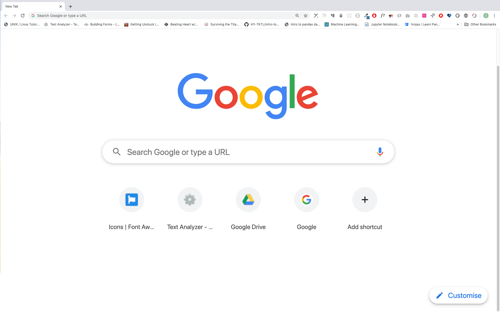
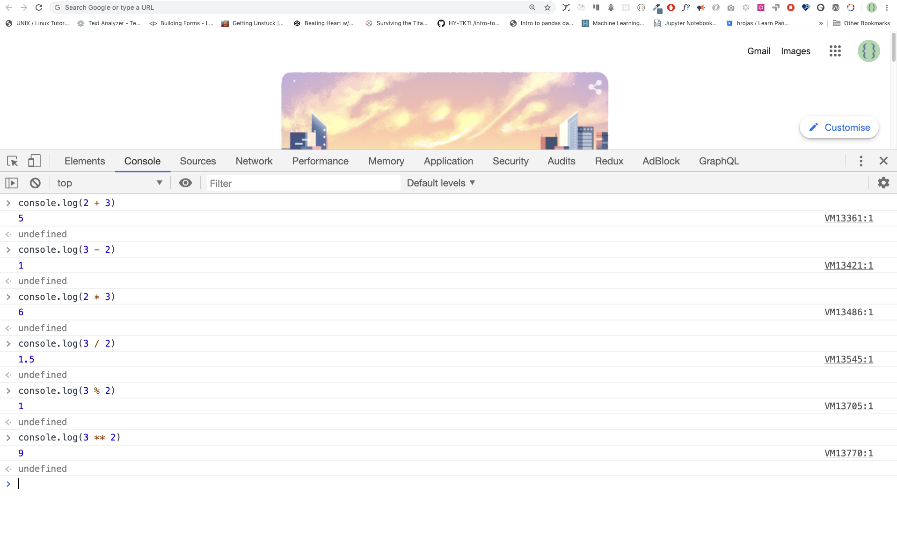
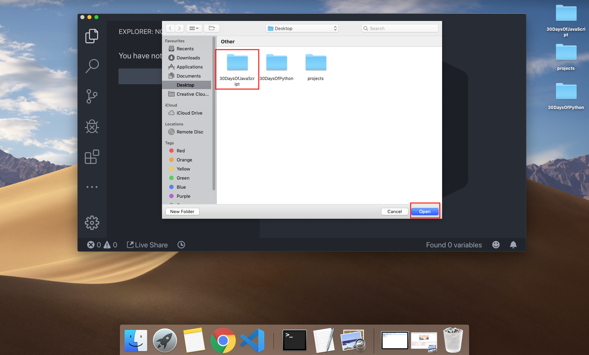

# 30 يومًا من جافا سكريبت

| # يوم |                                                                       المواضيع                                                                        |
| ----- | :-------------------------------------------------------------------------------------------------------------------------------------------------: |
| 01    |                                                             [Introduction-مقدمة](./readMe.md)                                                             |
| 02    |                                               [Data Types-أنواع البيانات](./02_Day_Data_types/02_day_data_types.md)                                                |
| 03    |                             [Booleans, Operators, Date-المنطقيات، العوامل، التاريخ](./03_Day_Booleans_operators_date/03_booleans_operators_date.md)                             |
| 04    |                                            [Conditionals-الشروط](./04_Day_Conditionals/04_day_conditionals.md)                                             |
| 05    |                                                     [Arrays-المتسلسلات](./05_Day_Arrays/05_day_arrays.md)                                                      |
| 06    |                                                       [Loops-حلقات](./06_Day_Loops/06_day_loops.md)                                                       |
| 07    |                                                 [Functions-الوظائف](./07_Day_Functions/07_day_functions.md)                                                 |
| 08    |                                                    [Objects-الأشياء](./08_Day_Objects/08_day_objects.md)                                                    |
| 09    |                             [Higher Order Functions-الأشياء ذات الرتب العليا](./09_Day_Higher_order_functions/09_day_higher_order_functions.md)                              |
| 10    |                                           [Sets and Maps-المجموعات والخرائط](./10_Day_Sets_and_Maps/10_day_Sets_and_Maps.md)                                           |
| 11    |                      [Destructuring and Spreading-التدمير والانتشار](./11_Day_Destructuring_and_spreading/11_day_destructuring_and_spreading.md)                      |
| 12    |                                  [Regular Expressions-التعبيرات العادية](./12_Day_Regular_expressions/12_day_regular_expressions.md)                                  |
| 13    |                             [Console Object Methods-طرق كائنات وحدة التحكم](./13_Day_Console_object_methods/13_day_console_object_methods.md)                              |
| 14    |                                         [Error Handling-معالجة الأخطاء](./14_Day_Error_handling/14_day_error_handling.md)                                          |
| 15    |                                                    [Classes-الفصول](./15_Day_Classes/15_day_classes.md)                                                    |
| 16    |                                                        [JSON-جسون](./16_Day_JSON/16_day_json.md)                                                         |
| 17    |                                            [Web Storages-مخازن الويب](./17_Day_Web_storages/17_day_web_storages.md)                                             |
| 18    |                                                  [Promises-الوعود](./18_Day_Promises/18_day_promises.md)                                                   |
| 19    |                                                   [Closure-الإغلاق](./19_Day_Closures/19_day_closures.md)                                                   |
| 20    |                                  [Writing Clean Code-كتابة كود نظيف](./20_Day_Writing_clean_codes/20_day_writing_clean_codes.md)                                   |
| 21    |                                                          [DOM-نموذج كائن المستند](./21_Day_DOM/21_day_dom.md)                                                          |
| 22    |                            [Manipulating DOM Object-معالجة نموذج كائن المستند](./22_Day_Manipulating_DOM_object/22_day_manipulating_DOM_object.md)                            |
| 23    |                                        [Event Listeners-مستمعو الأحداث](./23_Day_Event_listeners/23_day_event_listeners.md)                                        |
| 24    |                             [Mini Project: Solar System-مشروع صغير: النظام الشمسي](./24_Day_Project_solar_system/24_day_project_solar_system.md)                              |
| 25    | [Mini Project: World Countries Data Visualization 1-مشروع صغير: تصور بيانات دول العالم 1](./25_Day_World_countries_data_visualization_1/25_day_world_countries_data_visualization_1.md) |
| 26    | [Mini Project: World Countries Data Visualization 2-مشروع صغير: تصور بيانات دول العالم 2](./26_Day_World_countries_data_visualization_2/26_day_world_countries_data_visualization_2.md) |
| 27    |                             [Mini Project: Portfolio-مشروع صغير: بورتفوليو](./27_Day_Mini_project_portfolio/27_day_mini_project_portfolio.md)                             |
| 28    |                          [Mini Project: Leaderboard-مشروع صغير: لوحة المتصدرين](./28_Day_Mini_project_leaderboard/28_day_mini_project_leaderboard.md)                          |
| 29    |             [Mini Project: Animating characters-مشروع صغير: تحريك الشخصيات](./29_Day_Mini_project_animating_characters/29_day_mini_project_animating_characters.md)             |
| 30    |                                     [Final Projects-المشاريع النهائية](./30_Day_Mini_project_final/30_day_mini_project_final.md)                                      |
<br>
🧡🧡🧡 برمجة سعيدة 🧡🧡🧡
<br><br>
<div>
<small>ادعم <strong>مؤلف</strong> لإنشاء المزيد من المواد التعليمية</small> <br /><br>  
<a href = "https://www.paypal.me/asabeneh"></a>
</div>

<div align="center">
  <h1> 30 يومًا من جافا سكريبت: مقدمة</h1>
  <a class="header-badge" target="_blank" href="https://www.linkedin.com/in/asabeneh/">
  
  </a>
  <a class="header-badge" target="_blank" href="https://twitter.com/Asabeneh">
  
  </a>

<sub>:المؤلف
<a href="https://www.linkedin.com/in/asabeneh/" target="_blank">Asabeneh Yetayeh</a><br>
<small> يناير, 2020</small>
</sub>

<div>

🇬🇧 [English](../readMe.md) &nbsp;
AR [Arabic](readMe.md) &nbsp;
🇪🇸 [Spanish](../Spanish/readme.md) &nbsp;
🇮🇹 [Italian](../Italian/readMe.md) &nbsp;
🇷🇺 [Russian](../RU/README.md) &nbsp;
🇹🇷 [Turkish](../Turkish/readMe.md) &nbsp;
🇦🇿 [Azerbaijan](../Azerbaijani/readMe.md) &nbsp;
🇰🇷 [Korean](../Korea/README.md) &nbsp;
🇻🇳 [Vietnamese](../Vietnamese/README.md) &nbsp;
🇵🇱 [Polish](../Polish/readMe.md) &nbsp;
🇧🇷 [Portuguese](../Portuguese/readMe.md)

</div>

</div>
</div>

[يوم 2 >>](./02_Day_Data_types/02_day_data_types.md)


- [30 يومًا من جافا سكريبت](#30-days-of-javascript)
- [📔 يوم 1](#-day-1)
	- [المقدمة](#introduction)
	- [المتطلبات](#requirements)
	- [تجهيز](#setup)
		- [تثبيت Node.js](#install-nodejs)
		- [المتصفح](#browser)
			- [تثبيت جوجل كروم](#installing-google-chrome)
			- [فتح وحدة تحكم جوجل كروم](#opening-google-chrome-console)
			- [كتابة التعليمات البرمجية على وحدة تحكم المتصفح](#writing-code-on-browser-console)
				- [Console.log](#consolelog)
				- [Console.log مع وسيطات متعددة](#consolelog-with-multiple-arguments)
				- [التعليقات](#comments)
				- [بناء الجملة](#syntax)
			- [الحساب](#arithmetics)
		- [محرر الأكواد](#code-editor)
			- [تثبيت برنامج Visual Studio Code](#installing-visual-studio-code)
			- [كيفية استخدام  Visual Studio Code](#how-to-use-visual-studio-code)
	- [إضافة جافا سكريبت إلى صفحة ويب](#adding-javascript-to-a-web-page)
		- [Inline Script-البرنامج النصي المضمن](#inline-script)
		- [Internal Script-البرنامج النصي الداخلي](#internal-script)
		- [External Script-النص الخارجي](#external-script)
		- [Multiple External Scripts-برامج نصية خارجية متعددة](#multiple-external-scripts)
	- [مقدمة في أنواع البيانات](#introduction-to-data-types)
		- [الأرقام](#numbers)
		- [Strings-سلاسل النصوص](#strings)
		- [Booleans-المنطقيات](#booleans)
		- [Undefined-غير معرف](#undefined)
		- [Null-فارغة](#null)
	- [فحص أنواع البيانات](#checking-data-types)
	- [التعليقات مجدداً](#comments-again)
	- [المتغيرات](#variables)
- [💻 اليوم 1: التمارين](#-day-1-exercises)

# 📔 يوم 1

## المقدمة

**تهانينا الحارة** على قرار المشاركة في تحدي برمجة JavaScript لمدة 30 يومًا. في هذا التحدي، سوف تتعلم كل ما تحتاجه لتكون مبرمج جافا سكريبت، وبشكل عام، مفهوم البرمجة بالكامل. في نهاية التحدي، ستحصل على شهادة إكمال تحدي البرمجة 30DaysOfJavaScript. في حال كنت بحاجة إلى مساعدة أو إذا كنت ترغب في مساعدة الآخرين يمكنك الانضمام إلى [telegram group](https://t.me/ThirtyDaysOfJavaScript). 

**30 يومًا من JavaScript** التحدي هو دليل لمطوري جافا سكريبت المبتدئين والمتقدمين على حد سواء. مرحبًا بك في JavaScript. جافا سكريبت هي لغة الويب. أنا أستمتع باستخدام وتعليم الجافاسكريبت وأتمنى أن تستمتع أنت أيضًا.

في هذا التحدي خطوة بخطوة، سوف تتعلم لغة JavaScript، وهي لغة البرمجة الأكثر شهرة في تاريخ البشرية.
يتم استخدام JavaScript **_لإضافة تفاعلية إلى مواقع الويب، وتطوير تطبيقات الجوال، وتطبيقات سطح المكتب، والألعاب_** وفي الوقت الحاضر يمكن استخدام JavaScript لـ **البرمجة من جانب الخادم**,  **_التعلم الآلي_** and **_الذكاء الاصطناعي_**.

**_جافا سكريبت (JS)_** زادت شعبيتها في السنوات الأخيرة وأصبحت لغة البرمجة الرائدة على مدار السنوات العشر الماضية وهي لغة البرمجة الأكثر استخدامًا على
GitHub.

هذا التحدي سهل القراءة، ومكتوب باللغة الإنجليزية العامية، ومشوق ومحفز وفي نفس الوقت يتطلب الكثير من الجهد. تحتاج إلى تخصيص الكثير من الوقت لإنهاء هذا التحدي. إذا كنت من المتعلمين البصريين، فقد تحصل على درس الفيديو على <a href="https://www.youtube.com/channel/UC7PNRuno1rzYPb1xLa4yktw"> Washera</a> قناة يوتيوب. اشترك في القناة وعلق واطرح أسئلة على مقاطع الفيديو على يوتيوب وكن مبادرًا، سيلاحظك المؤلف في النهاية. 

يحب المؤلف أن يسمع رأيك حول التحدي، شارك المؤلف بالتعبير عن أفكارك حول تحدي 30DaysOfJavaScript. يمكنك ترك شهادتك على هذا [link](https://testimonial-vdzd.onrender.com//)

## المتطلبات

لا يلزم معرفة مسبقة بالبرمجة لمتابعة هذا التحدي. ما عليك سوى:

1. الدافع
2. حاسوب
3. الانترنت
4. متصفح
5. محرر الأكواد

## تجهيز

أعتقد أن لديك الدافع والرغبة القوية في أن تكون مطورًا وحاسوبًا وإنترنت. إذا كان لديك كل ذلك، فلديك كل شيء للبدء.

### تثبيت Node.js

قد لا تحتاج إلى Node.js الآن ولكنك قد تحتاجه في وقت لاحق. تثبيت [node.js](https://nodejs.org/en/).


بعد التنزيل انقر نقرًا مزدوجًا وقم بالتثبيت


يمكننا التحقق من تثبيت العقدة على جهازنا المحلي عن طريق فتح محطة الجهاز أو موجه الأوامر.

```sh
asabeneh $ node -v
v12.14.0
```

عند إنشاء هذا البرنامج التعليمي كنت أستخدم إصدار Node 12.14.0، ولكن الآن الإصدار الموصى به من Node.js للتنزيل هو v14.17.6، وبحلول الوقت الذي تستخدم فيه هذه المادة قد يكون لديك إصدار Node.js أعلى.

### المتصفح

هناك العديد من المتصفحات المتاحة. ومع ذلك، أوصي بشدة باستخدام Google Chrome.

#### تثبيت Google Chrome

قم بتثبيت [Google Chrome](https://www.google.com/chrome/) إذا لم يكن لديك متصفح بعد. يمكننا كتابة كود JavaScript صغير على وحدة تحكم المتصفح، لكننا لا نستخدم وحدة تحكم المتصفح لتطوير التطبيقات.



#### فتح وحدة تحكم Google Chrome

يمكنك فتح وحدة تحكم جوجل كروم إما بالنقر على ثلاث نقاط في الزاوية العلوية اليمنى من المتصفح، أو اختيار _المزيد من الأدوات -> أدوات المطور_ أو باستخدام اختصار لوحة المفاتيح. أفضل استخدام الاختصارات.


لفتح وحدة تحكم Chrome باستخدام اختصار لوحة المفاتيح.

```sh
Mac
Command+Option+J

Windows/Linux:
Ctl+Shift+J
```


بعد أن تفتح وحدة تحكم Google Chrome، حاول استكشاف الأزرار المحددة. سنقضي معظم الوقت في وحدة التحكم. وحدة التحكم هي المكان الذي تذهب إليه شيفرة JavaScript الخاصة بك. يقوم محرك Google Console V8 بتحويل شيفرة جافا سكريبت الخاصة بك إلى شيفرة آلية.
دعنا نكتب شيفرة JavaScript على وحدة تحكم Google Chrome:


#### كتابة التعليمات البرمجية على وحدة تحكم المتصفح

يمكننا كتابة أي كود JavaScript على وحدة تحكم Google أو أي وحدة تحكم في المتصفح. ومع ذلك، في هذا التحدي، نركز فقط على وحدة تحكم Google Chrome. افتح وحدة التحكم باستخدام:

```sh
Mac
Command+Option+I

Windows:
Ctl+Shift+I
```

##### Console.log

To write our first JavaScript code, we used a built-in function **console.log()**. We passed an argument as input data, and the function displays the output. We passed `'Hello, World'` as input data or argument in the console.log() function.

```js
console.log('Hello, World!')
```

##### Console.log with Multiple Arguments

The **`console.log()`** function can take multiple parameters separated by commas. The syntax looks like as follows:**`console.log(param1, param2, param3)`**


```js
console.log('Hello', 'World', '!')
console.log('HAPPY', 'NEW', 'YEAR', 2020)
console.log('Welcome', 'to', 30, 'Days', 'Of', 'JavaScript')
```

As you can see from the snippet code above, _`console.log()`_ can take multiple arguments.

Congratulations! You wrote your first JavaScript code using _`console.log()`_.

##### Comments

We can add comments to our code. Comments are very important to make code more readable and to leave remarks in our code. JavaScript does not execute the comment part of our code. In JavaScript, any text line starting with // in JavaScript is a comment, and anything enclosed like this `//` is also a comment.

**Example: Single Line Comment**

```js
// This is the first comment  
// This is the second comment  
// I am a single line comment
```

**Example: Multiline Comment**

```js
/*
This is a multiline comment  
 Multiline comments can take multiple lines  
 JavaScript is the language of the web  
 */
```

##### Syntax

Programming languages are similar to human languages. English or many other language uses words, phrases, sentences, compound sentences and other more to convey a meaningful message. The English meaning of syntax is _the arrangement of words and phrases to create well-formed sentences in a language_. The technical definition of syntax is the structure of statements in a computer language. Programming languages have syntax. JavaScript is a programming language and like other programming languages it has its own syntax. If we do not write a syntax that JavaScript understands, it will raise different types of errors. We will explore different kinds of JavaScript errors later. For now, let us see syntax errors.


I made a deliberate mistake. As a result, the console raises syntax errors. Actually, the syntax is very informative. It informs what type of mistake was made. By reading the error feedback guideline, we can correct the syntax and fix the problem. The process of identifying and removing errors from a program is called debugging. Let us fix the errors:

```js
console.log('Hello, World!')
console.log('Hello, World!')
```

So far, we saw how to display text using the _`console.log()`_. If we are printing text or string using _`console.log()`_, the text has to be inside the single quotes, double quotes, or a backtick.
**Example:**

```js
console.log('Hello, World!')
console.log("Hello, World!")
console.log(`Hello, World!`)
```

#### الرياضيات

الآن، دعنا نتدرب على كتابة أكواد JavaScript باستخدام _`console.log()`_ على وحدة تحكم Google Chrome لأنواع البيانات الرقمية.
بالإضافة إلى النص، يمكننا أيضًا إجراء حسابات رياضية باستخدام JavaScript. دعنا نجري الحسابات البسيطة التالية.
من الممكن كتابة أكواد JavaScript على وحدة تحكم Google Chrome مباشرةً بدون وظيفة **_`console.log()`_**. ومع ذلك، فهي مدرجة في هذه المقدمة لأن معظم هذا التحدي سيتم في محرر نصوص حيث يكون استخدام الوظيفة إلزاميًا. يمكنك اللعب مباشرةً بالتعليمات الموجودة على وحدة التحكم.



```js
console.log(2 + 3) // Addition
console.log(3 - 2) // Subtraction
console.log(2 * 3) // Multiplication
console.log(3 / 2) // Division
console.log(3 % 2) // Modulus - finding remainder
console.log(3 ** 2) // Exponentiation 3 ** 2 == 3 * 3
```

### محرر الكود

يمكننا كتابة أكوادنا على وحدة تحكم المتصفح، ولكن لن يكون ذلك لمشاريع أكبر. في بيئة العمل الحقيقية، يستخدم المطورون محررات أكواد مختلفة لكتابة أكوادهم. في تحدي JavaScript الذي يستمر 30 يومًا، سنستخدم Visual Studio Code.

#### تثبيت Visual Studio Code

يعد [Visual Studio Code] محرر نصوص مفتوح المصدر شائعًا للغاية. أوصي بتنزيل Visual Studio Code (https://code.visualstudio.com/)، ولكن إذا كنت تفضل استخدام محررات أخرى، فلا تتردد في متابعة ما لديك.


If you installed Visual Studio Code, let us start using it.

#### How to Use Visual Studio Code

Open the Visual Studio Code by double-clicking its icon. When you open it, you will get this kind of interface. Try to interact with the labeled icons.





## Adding JavaScript to a Web Page

JavaScript can be added to a web page in three different ways:

- **_Inline script_**
- **_Internal script_**
- **_External script_**
- **_Multiple External scripts_**

The following sections show different ways of adding JavaScript code to your web page.

### Inline Script

Create a project folder on your desktop or in any location, name it 30DaysOfJS and create an **_`index.html`_** file in the project folder. Then paste the following code and open it in a browser, for example [Chrome](https://www.google.com/chrome/).

```html
<!DOCTYPE html>
<html lang="en">
  <head>
    <title>30DaysOfScript:Inline Script</title>
  </head>
  <body>
    <button onclick="alert('Welcome to 30DaysOfJavaScript!')">Click Me</button>
  </body>
</html>
```

Now, you just wrote your first inline script. We can create a pop up alert message using the _`alert()`_ built-in function.

### Internal Script

The internal script can be written in the _`head`_ or the _`body`_, but it is preferred to put it on the body of the HTML document.
First, let us write on the head part of the page.

```html
<!DOCTYPE html>
<html lang="en">
  <head>
    <title>30DaysOfScript:Internal Script</title>
    <script>
      console.log('Welcome to 30DaysOfJavaScript')
    </script>
  </head>
  <body></body>
</html>
```

This is how we write an internal script most of the time. Writing the JavaScript code in the body section is the most preferred option. Open the browser console to see the output from the `console.log()`.

```html
<!DOCTYPE html>
<html lang="en">
  <head>
    <title>30DaysOfScript:Internal Script</title>
  </head>
  <body>
    <button onclick="alert('Welcome to 30DaysOfJavaScript!');">Click Me</button>
    <script>
      console.log('Welcome to 30DaysOfJavaScript')
    </script>
  </body>
</html>
```

Open the browser console to see the output from the `console.log()`.


### External Script

Similar to the internal script, the external script link can be on the header or body, but it is preferred to put it in the body.
First, we should create an external JavaScript file with .js extension. All files ending with .js extension are JavaScript files. Create a file named introduction.js inside your project directory and write the following code and link this .js file at the bottom of the body.

```js
console.log('Welcome to 30DaysOfJavaScript')
```

External scripts in the _head_:

```html
<!DOCTYPE html>
<html lang="en">
  <head>
    <title>30DaysOfJavaScript:External script</title>
    <script src="introduction.js"></script>
  </head>
  <body></body>
</html>
```

External scripts in the _body_:

```html
<!DOCTYPE html>
<html lang="en">
  <head>
    <title>30DaysOfJavaScript:External script</title>
  </head>
  <body>
    <!-- JavaScript external link could be in the header or in the body --> 
    <!-- Before the closing tag of the body is the recommended place to put the external JavaScript script -->
    <script src="introduction.js"></script>
  </body>
</html>
```

Open the browser console to see the output of the `console.log()`.

### Multiple External Scripts

We can also link multiple external JavaScript files to a web page.
Create a `helloworld.js` file inside the 30DaysOfJS folder and write the following code.

```js
console.log('Hello, World!')
```

```html
<!DOCTYPE html>
<html lang="en">
  <head>
    <title>Multiple External Scripts</title>
  </head>
  <body>
    <script src="./helloworld.js"></script>
    <script src="./introduction.js"></script>
  </body>
</html>
```

_Your main.js file should be below all other scripts_. It is very important to remember this.


## Introduction to Data types

In JavaScript and also other programming languages, there are different types of data types. The following are JavaScript primitive data types: _String, Number, Boolean, undefined, Null_, and _Symbol_.

### Numbers

- Integers: Integer (negative, zero and positive) numbers
  Example:
  ... -3, -2, -1, 0, 1, 2, 3 ...
- Float-point numbers: Decimal number
  Example
  ... -3.5, -2.25, -1.0, 0.0, 1.1, 2.2, 3.5 ...

### Strings

A collection of one or more characters between two single quotes, double quotes, or backticks.

**Example:**

```js
'a'
'Asabeneh'
"Asabeneh"
'Finland'
'JavaScript is a beautiful programming language'
'I love teaching'
'I hope you are enjoying the first day'
`We can also create a string using a backtick`
'A string could be just as small as one character or as big as many pages'
'Any data type under a single quote, double quote or backtick is a string'
```

### Booleans

A boolean value is either True or False. Any comparisons returns a boolean value, which is either true or false.

A boolean data type is either a true or false value.

**Example:**

```js
true // if the light is on, the value is true
false // if the light is off, the value is false
```

### Undefined

In JavaScript, if we don't assign a value to a variable, the value is undefined. In addition to that, if a function is not returning anything, it returns undefined.

```js
let firstName
console.log(firstName) // undefined, because it is not assigned to a value yet
```

### Null

Null in JavaScript means an empty value.

```js
let emptyValue = null
```

## Checking Data Types

To check the data type of a certain variable, we use the **typeof** operator. See the following example.

```js
console.log(typeof 'Asabeneh') // string
console.log(typeof 5) // number
console.log(typeof true) // boolean
console.log(typeof null) // object type
console.log(typeof undefined) // undefined
```

## Comments Again

Remember that commenting in JavaScript is similar to other programming languages. Comments are important in making your code more readable.
There are two ways of commenting:

- _Single line commenting_
- _Multiline commenting_

```js
// commenting the code itself with a single comment
// let firstName = 'Asabeneh'; single line comment
// let lastName = 'Yetayeh'; single line comment
```

Multiline commenting:

```js
/*
  let location = 'Helsinki';
  let age = 100;
  let isMarried = true;
  This is a Multiple line comment
*/
```

## Variables

Variables are _containers_ of data. Variables are used to _store_ data in a memory location. When a variable is declared, a memory location is reserved. When a variable is assigned to a value (data), the memory space will be filled with that data. To declare a variable, we use _var_, _let_, or _const_ keywords.

For a variable that changes at a different time, we use _let_. If the data does not change at all, we use _const_. For example, PI, country name, gravity do not change, and we can use _const_. We will not use var in this challenge and I don't recommend you to use it. It is error prone way of declaring variable it has lots of leak. We will talk more about var, let, and const in detail in other sections (scope). For now, the above explanation is enough.

A valid JavaScript variable name must follow the following rules:

- A JavaScript variable name should not begin with a number.
- A JavaScript variable name does not allow special characters except dollar sign and underscore.
- A JavaScript variable name follows a camelCase convention.
- A JavaScript variable name should not have space between words.

The following are examples of valid JavaScript variables.

```js
firstName
lastName
country
city
capitalCity
age
isMarried

first_name
last_name
is_married
capital_city

num1
num_1
_num_1
$num1
year2020
year_2020
```

The first and second variables on the list follows the camelCase convention of declaring in JavaScript. In this material, we will use camelCase variables(camelWithOneHump). We use CamelCase(CamelWithTwoHump) to declare classes, we will discuss about classes and objects in other section.

Example of invalid variables:

```js
  first-name
  1_num
  num_#_1
```

Let us declare variables with different data types. To declare a variable, we need to use _let_ or _const_ keyword before the variable name. Following the variable name, we write an equal sign (assignment operator), and a value(assigned data).

```js
// Syntax
let nameOfVariable = value
```

The nameOfVriable is the name that stores different data of value. See below for detail examples.

**Examples of declared variables**

```js
// Declaring different variables of different data types
let firstName = 'Asabeneh' // first name of a person
let lastName = 'Yetayeh' // last name of a person
let country = 'Finland' // country
let city = 'Helsinki' // capital city
let age = 100 // age in years
let isMarried = true

console.log(firstName, lastName, country, city, age, isMarried)
```

```sh
Asabeneh Yetayeh Finland Helsinki 100 true
```

```js
// Declaring variables with number values
let age = 100 // age in years
const gravity = 9.81 // earth gravity  in m/s2
const boilingPoint = 100 // water boiling point, temperature in °C
const PI = 3.14 // geometrical constant
console.log(gravity, boilingPoint, PI)
```

```sh
9.81 100 3.14
```

```js
// Variables can also be declaring in one line separated by comma, however I recommend to use a seperate line to make code more readble
let name = 'Asabeneh', job = 'teacher', live = 'Finland'
console.log(name, job, live)
```

```sh
Asabeneh teacher Finland
```

When you run _index.html_ file in the 01-Day folder you should get this:


🌕 You are amazing! You have just completed day 1 challenge and you are on your way to greatness. Now do some exercises for your brain and muscle.

# 💻 Day 1: Exercises

1. Write a single line comment which says, _comments can make code readable_
2. Write another single comment which says, _Welcome to 30DaysOfJavaScript_
3. Write a multiline comment which says, _comments can make code readable, easy to reuse_
   _and informative_

4. Create a variable.js file and declare variables and assign string, boolean, undefined and null data types
5. Create datatypes.js file and use the JavaScript **_typeof_** operator to check different data types. Check the data type of each variable
6. Declare four variables without assigning values
7. Declare four variables with assigned values
8. Declare variables to store your first name, last name, marital status, country and age in multiple lines
9. Declare variables to store your first name, last name, marital status, country and age in a single line
10. Declare two variables _myAge_ and _yourAge_ and assign them initial values and log to the browser console.

```sh
I am 25 years old.
You are 30 years old.
```

🎉 CONGRATULATIONS ! 🎉

[Day 2 >>](./02_Day_Data_types/02_day_data_types.md)
