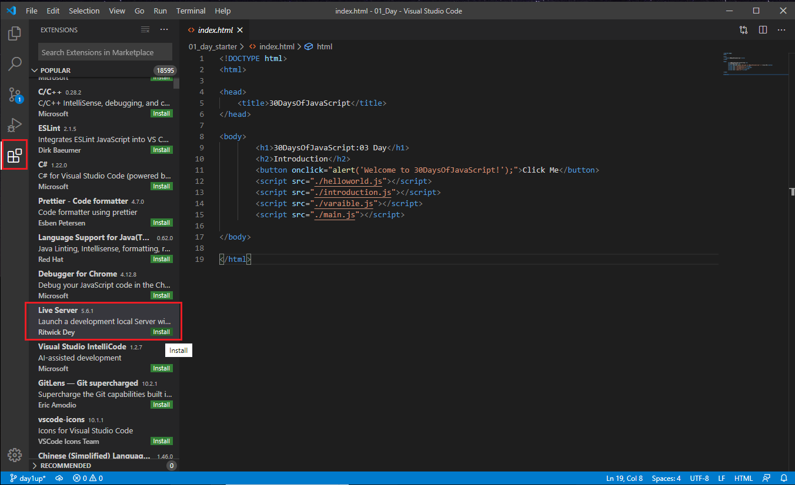

# 30 يومًا من جافا سكريبت

| # يوم |                                                                       المواضيع                                                                        |
| ----- | :-------------------------------------------------------------------------------------------------------------------------------------------------: |
| 01    |                                                             [Introduction-مقدمة](./readMe.md)                                                             |
| 02    |                                               [Data Types-أنواع البيانات](./02_Day_Data_types/02_day_data_types.md)                                                |
| 03    |                             [Booleans, Operators, Date-المنطقيات، العوامل، التاريخ](./03_Day_Booleans_operators_date/03_booleans_operators_date.md)                             |
| 04    |                                            [Conditionals-الشروط](./04_Day_Conditionals/04_day_conditionals.md)                                             |
| 05    |                                                     [Arrays-المتسلسلات](./05_Day_Arrays/05_day_arrays.md)                                                      |
| 06    |                                                       [Loops-حلقات](./06_Day_Loops/06_day_loops.md)                                                       |
| 07    |                                                 [Functions-الوظائف](./07_Day_Functions/07_day_functions.md)                                                 |
| 08    |                                                    [Objects-الأشياء](./08_Day_Objects/08_day_objects.md)                                                    |
| 09    |                             [Higher Order Functions-الأشياء ذات الرتب العليا](./09_Day_Higher_order_functions/09_day_higher_order_functions.md)                              |
| 10    |                                           [Sets and Maps-المجموعات والخرائط](./10_Day_Sets_and_Maps/10_day_Sets_and_Maps.md)                                           |
| 11    |                      [Destructuring and Spreading-التدمير والانتشار](./11_Day_Destructuring_and_spreading/11_day_destructuring_and_spreading.md)                      |
| 12    |                                  [Regular Expressions-التعبيرات العادية](./12_Day_Regular_expressions/12_day_regular_expressions.md)                                  |
| 13    |                             [Console Object Methods-طرق كائنات وحدة التحكم](./13_Day_Console_object_methods/13_day_console_object_methods.md)                              |
| 14    |                                         [Error Handling-معالجة الأخطاء](./14_Day_Error_handling/14_day_error_handling.md)                                          |
| 15    |                                                    [Classes-الفصول](./15_Day_Classes/15_day_classes.md)                                                    |
| 16    |                                                        [JSON-جسون](./16_Day_JSON/16_day_json.md)                                                         |
| 17    |                                            [Web Storages-مخازن الويب](./17_Day_Web_storages/17_day_web_storages.md)                                             |
| 18    |                                                  [Promises-الوعود](./18_Day_Promises/18_day_promises.md)                                                   |
| 19    |                                                   [Closure-الإغلاق](./19_Day_Closures/19_day_closures.md)                                                   |
| 20    |                                  [Writing Clean Code-كتابة كود نظيف](./20_Day_Writing_clean_codes/20_day_writing_clean_codes.md)                                   |
| 21    |                                                          [DOM-نموذج كائن المستند](./21_Day_DOM/21_day_dom.md)                                                          |
| 22    |                            [Manipulating DOM Object-معالجة نموذج كائن المستند](./22_Day_Manipulating_DOM_object/22_day_manipulating_DOM_object.md)                            |
| 23    |                                        [Event Listeners-مستمعو الأحداث](./23_Day_Event_listeners/23_day_event_listeners.md)                                        |
| 24    |                             [Mini Project: Solar System-مشروع صغير: النظام الشمسي](./24_Day_Project_solar_system/24_day_project_solar_system.md)                              |
| 25    | [Mini Project: World Countries Data Visualization 1-مشروع صغير: تصور بيانات دول العالم 1](./25_Day_World_countries_data_visualization_1/25_day_world_countries_data_visualization_1.md) |
| 26    | [Mini Project: World Countries Data Visualization 2-مشروع صغير: تصور بيانات دول العالم 2](./26_Day_World_countries_data_visualization_2/26_day_world_countries_data_visualization_2.md) |
| 27    |                             [Mini Project: Portfolio-مشروع صغير: بورتفوليو](./27_Day_Mini_project_portfolio/27_day_mini_project_portfolio.md)                             |
| 28    |                          [Mini Project: Leaderboard-مشروع صغير: لوحة المتصدرين](./28_Day_Mini_project_leaderboard/28_day_mini_project_leaderboard.md)                          |
| 29    |             [Mini Project: Animating characters-مشروع صغير: تحريك الشخصيات](./29_Day_Mini_project_animating_characters/29_day_mini_project_animating_characters.md)             |
| 30    |                                     [Final Projects-المشاريع النهائية](./30_Day_Mini_project_final/30_day_mini_project_final.md)                                      |
<br>
🧡🧡🧡 برمجة سعيدة 🧡🧡🧡
<br><br>
<div>
<small>ادعم <strong>مؤلف</strong> لإنشاء المزيد من المواد التعليمية</small> <br /><br>  
<a href = "https://www.paypal.me/asabeneh"></a>
</div>

<div align="center">
  <h1> 30 يومًا من جافا سكريبت: مقدمة</h1>
  <a class="header-badge" target="_blank" href="https://www.linkedin.com/in/asabeneh/">
  
  </a>
  <a class="header-badge" target="_blank" href="https://twitter.com/Asabeneh">
  
  </a>

<sub>:المؤلف
<a href="https://www.linkedin.com/in/asabeneh/" target="_blank">Asabeneh Yetayeh</a><br>
<small> يناير, 2020</small>
</sub>

<div>

🇬🇧 [English](../readMe.md) &nbsp;
AR [Arabic](readMe.md) &nbsp;
🇪🇸 [Spanish](../Spanish/readme.md) &nbsp;
🇮🇹 [Italian](../Italian/readMe.md) &nbsp;
🇷🇺 [Russian](../RU/README.md) &nbsp;
🇹🇷 [Turkish](../Turkish/readMe.md) &nbsp;
🇦🇿 [Azerbaijan](../Azerbaijani/readMe.md) &nbsp;
🇰🇷 [Korean](../Korea/README.md) &nbsp;
🇻🇳 [Vietnamese](../Vietnamese/README.md) &nbsp;
🇵🇱 [Polish](../Polish/readMe.md) &nbsp;
🇧🇷 [Portuguese](../Portuguese/readMe.md)

</div>

</div>
</div>

[يوم 2 >>](./02_Day_Data_types/02_day_data_types.md)


- [30 يومًا من جافا سكريبت](#30-days-of-javascript)
- [📔 يوم 1](#-day-1)
	- [المقدمة](#introduction)
	- [المتطلبات](#requirements)
	- [تجهيز](#setup)
		- [تثبيت Node.js](#install-nodejs)
		- [المتصفح](#browser)
			- [تثبيت جوجل كروم](#installing-google-chrome)
			- [فتح وحدة تحكم جوجل كروم](#opening-google-chrome-console)
			- [كتابة التعليمات البرمجية على وحدة تحكم المتصفح](#writing-code-on-browser-console)
				- [Console.log](#consolelog)
				- [Console.log مع وسيطات متعددة](#consolelog-with-multiple-arguments)
				- [التعليقات](#comments)
				- [بناء الجملة](#syntax)
			- [الحساب](#arithmetics)
		- [محرر الأكواد](#code-editor)
			- [تثبيت برنامج Visual Studio Code](#installing-visual-studio-code)
			- [كيفية استخدام  Visual Studio Code](#how-to-use-visual-studio-code)
	- [إضافة جافا سكريبت إلى صفحة ويب](#adding-javascript-to-a-web-page)
		- [Inline Script-البرنامج النصي المضمن](#inline-script)
		- [Internal Script-البرنامج النصي الداخلي](#internal-script)
		- [External Script-النص الخارجي](#external-script)
		- [Multiple External Scripts-برامج نصية خارجية متعددة](#multiple-external-scripts)
	- [مقدمة في أنواع البيانات](#introduction-to-data-types)
		- [الأرقام](#numbers)
		- [Strings-سلاسل النصوص](#strings)
		- [Booleans-المنطقيات](#booleans)
		- [Undefined-غير معرف](#undefined)
		- [Null-فارغة](#null)
	- [فحص أنواع البيانات](#checking-data-types)
	- [التعليقات مجدداً](#comments-again)
	- [المتغيرات](#variables)
- [💻 اليوم 1: التمارين](#-day-1-exercises)

# 📔 يوم 1

## المقدمة

**تهانينا الحارة** على قرار المشاركة في تحدي برمجة JavaScript لمدة 30 يومًا. في هذا التحدي، سوف تتعلم كل ما تحتاجه لتكون مبرمج جافا سكريبت، وبشكل عام، مفهوم البرمجة بالكامل. في نهاية التحدي، ستحصل على شهادة إكمال تحدي البرمجة 30DaysOfJavaScript. في حال كنت بحاجة إلى مساعدة أو إذا كنت ترغب في مساعدة الآخرين يمكنك الانضمام إلى [telegram group](https://t.me/ThirtyDaysOfJavaScript). 

**30 يومًا من JavaScript** التحدي هو دليل لمطوري جافا سكريبت المبتدئين والمتقدمين على حد سواء. مرحبًا بك في JavaScript. جافا سكريبت هي لغة الويب. أنا أستمتع باستخدام وتعليم الجافاسكريبت وأتمنى أن تستمتع أنت أيضًا.

في هذا التحدي خطوة بخطوة، سوف تتعلم لغة JavaScript، وهي لغة البرمجة الأكثر شهرة في تاريخ البشرية.
يتم استخدام JavaScript **_لإضافة تفاعلية إلى مواقع الويب، وتطوير تطبيقات الجوال، وتطبيقات سطح المكتب، والألعاب_** وفي الوقت الحاضر يمكن استخدام JavaScript لـ **البرمجة من جانب الخادم**,  **_التعلم الآلي_** and **_الذكاء الاصطناعي_**.

**_جافا سكريبت (JS)_** زادت شعبيتها في السنوات الأخيرة وأصبحت لغة البرمجة الرائدة على مدار السنوات العشر الماضية وهي لغة البرمجة الأكثر استخدامًا على
GitHub.

هذا التحدي سهل القراءة، ومكتوب باللغة الإنجليزية العامية، ومشوق ومحفز وفي نفس الوقت يتطلب الكثير من الجهد. تحتاج إلى تخصيص الكثير من الوقت لإنهاء هذا التحدي. إذا كنت من المتعلمين البصريين، فقد تحصل على درس الفيديو على <a href="https://www.youtube.com/channel/UC7PNRuno1rzYPb1xLa4yktw"> Washera</a> قناة يوتيوب. اشترك في القناة وعلق واطرح أسئلة على مقاطع الفيديو على يوتيوب وكن مبادرًا، سيلاحظك المؤلف في النهاية. 

يحب المؤلف أن يسمع رأيك حول التحدي، شارك المؤلف بالتعبير عن أفكارك حول تحدي 30DaysOfJavaScript. يمكنك ترك شهادتك على هذا [link](https://testimonial-vdzd.onrender.com//)

## المتطلبات

لا يلزم معرفة مسبقة بالبرمجة لمتابعة هذا التحدي. ما عليك سوى:

1. الدافع
2. حاسوب
3. الانترنت
4. متصفح
5. محرر الأكواد

## تجهيز

أعتقد أن لديك الدافع والرغبة القوية في أن تكون مطورًا وحاسوبًا وإنترنت. إذا كان لديك كل ذلك، فلديك كل شيء للبدء.

### تثبيت Node.js

قد لا تحتاج إلى Node.js الآن ولكنك قد تحتاجه في وقت لاحق. تثبيت [node.js](https://nodejs.org/en/).


بعد التنزيل انقر نقرًا مزدوجًا وقم بالتثبيت


يمكننا التحقق من تثبيت العقدة على جهازنا المحلي عن طريق فتح محطة الجهاز أو موجه الأوامر.

```sh
asabeneh $ node -v
v12.14.0
```

عند إنشاء هذا البرنامج التعليمي كنت أستخدم إصدار Node 12.14.0، ولكن الآن الإصدار الموصى به من Node.js للتنزيل هو v14.17.6، وبحلول الوقت الذي تستخدم فيه هذه المادة قد يكون لديك إصدار Node.js أعلى.

### المتصفح

هناك العديد من المتصفحات المتاحة. ومع ذلك، أوصي بشدة باستخدام Google Chrome.

#### تثبيت Google Chrome

قم بتثبيت [Google Chrome](https://www.google.com/chrome/) إذا لم يكن لديك متصفح بعد. يمكننا كتابة كود JavaScript صغير على وحدة تحكم المتصفح، لكننا لا نستخدم وحدة تحكم المتصفح لتطوير التطبيقات.


#### فتح وحدة تحكم Google Chrome

يمكنك فتح وحدة تحكم جوجل كروم إما بالنقر على ثلاث نقاط في الزاوية العلوية اليمنى من المتصفح، أو اختيار _المزيد من الأدوات -> أدوات المطور_ أو باستخدام اختصار لوحة المفاتيح. أفضل استخدام الاختصارات.


لفتح وحدة تحكم Chrome باستخدام اختصار لوحة المفاتيح.

```sh
Mac
Command+Option+J

Windows/Linux:
Ctl+Shift+J
```


بعد أن تفتح وحدة تحكم Google Chrome، حاول استكشاف الأزرار المحددة. سنقضي معظم الوقت في وحدة التحكم. وحدة التحكم هي المكان الذي تذهب إليه شيفرة JavaScript الخاصة بك. يقوم محرك Google Console V8 بتحويل شيفرة جافا سكريبت الخاصة بك إلى شيفرة آلية.
دعنا نكتب شيفرة JavaScript على وحدة تحكم Google Chrome:


#### كتابة التعليمات البرمجية على وحدة تحكم المتصفح

يمكننا كتابة أي كود JavaScript على وحدة تحكم Google أو أي وحدة تحكم في المتصفح. ومع ذلك، في هذا التحدي، نركز فقط على وحدة تحكم Google Chrome. افتح وحدة التحكم باستخدام:

```sh
Mac
Command+Option+I

Windows:
Ctl+Shift+I
```

##### Console.log

To write our first JavaScript code, we used a built-in function **console.log()**. We passed an argument as input data, and the function displays the output. We passed `'Hello, World'` as input data or argument in the console.log() function.

```js
console.log('Hello, World!')
```

##### Console.log with Multiple Arguments

The **`console.log()`** function can take multiple parameters separated by commas. The syntax looks like as follows:**`console.log(param1, param2, param3)`**


```js
console.log('Hello', 'World', '!')
console.log('HAPPY', 'NEW', 'YEAR', 2020)
console.log('Welcome', 'to', 30, 'Days', 'Of', 'JavaScript')
```

As you can see from the snippet code above, _`console.log()`_ can take multiple arguments.

Congratulations! You wrote your first JavaScript code using _`console.log()`_.

##### Comments

We can add comments to our code. Comments are very important to make code more readable and to leave remarks in our code. JavaScript does not execute the comment part of our code. In JavaScript, any text line starting with // in JavaScript is a comment, and anything enclosed like this `//` is also a comment.

**Example: Single Line Comment**

```js
// This is the first comment  
// This is the second comment  
// I am a single line comment
```

**Example: Multiline Comment**

```js
/*
This is a multiline comment  
 Multiline comments can take multiple lines  
 JavaScript is the language of the web  
 */
```

##### Syntax

Programming languages are similar to human languages. English or many other language uses words, phrases, sentences, compound sentences and other more to convey a meaningful message. The English meaning of syntax is _the arrangement of words and phrases to create well-formed sentences in a language_. The technical definition of syntax is the structure of statements in a computer language. Programming languages have syntax. JavaScript is a programming language and like other programming languages it has its own syntax. If we do not write a syntax that JavaScript understands, it will raise different types of errors. We will explore different kinds of JavaScript errors later. For now, let us see syntax errors.


I made a deliberate mistake. As a result, the console raises syntax errors. Actually, the syntax is very informative. It informs what type of mistake was made. By reading the error feedback guideline, we can correct the syntax and fix the problem. The process of identifying and removing errors from a program is called debugging. Let us fix the errors:

```js
console.log('Hello, World!')
console.log('Hello, World!')
```

So far, we saw how to display text using the _`console.log()`_. If we are printing text or string using _`console.log()`_, the text has to be inside the single quotes, double quotes, or a backtick.
**Example:**

```js
console.log('Hello, World!')
console.log("Hello, World!")
console.log(`Hello, World!`)
```

#### الرياضيات

الآن، دعنا نتدرب على كتابة أكواد JavaScript باستخدام _`console.log()`_ على وحدة تحكم Google Chrome لأنواع البيانات الرقمية.
بالإضافة إلى النص، يمكننا أيضًا إجراء حسابات رياضية باستخدام JavaScript. دعنا نجري الحسابات البسيطة التالية.
من الممكن كتابة أكواد JavaScript على وحدة تحكم Google Chrome مباشرةً بدون وظيفة **_`console.log()`_**. ومع ذلك، فهي مدرجة في هذه المقدمة لأن معظم هذا التحدي سيتم في محرر نصوص حيث يكون استخدام الوظيفة إلزاميًا. يمكنك اللعب مباشرةً بالتعليمات الموجودة على وحدة التحكم.


```js
console.log(2 + 3) // Addition
console.log(3 - 2) // Subtraction
console.log(2 * 3) // Multiplication
console.log(3 / 2) // Division
console.log(3 % 2) // Modulus - finding remainder
console.log(3 ** 2) // Exponentiation 3 ** 2 == 3 * 3
```

### محرر الكود

يمكننا كتابة أكوادنا على وحدة تحكم المتصفح، ولكن لن يكون ذلك لمشاريع أكبر. في بيئة العمل الحقيقية، يستخدم المطورون محررات أكواد مختلفة لكتابة أكوادهم. في تحدي JavaScript الذي يستمر 30 يومًا، سنستخدم Visual Studio Code.

#### تثبيت Visual Studio Code

يعد Visual Studio Code محرر نصوص مفتوح المصدر شائعًا للغاية. أوصي بتنزيل [Visual Studio Code](https://code.visualstudio.com/)، ولكن إذا كنت تفضل استخدام محررات أخرى، فلا تتردد في متابعة ما لديك.


إذا قمت بتثبيت Visual Studio Code، فلنبدأ في استخدامه.

#### كيفية استخدام Visual Studio Code

افتح Visual Studio Code بالنقر المزدوج على أيقونته. عند فتحه، ستحصل على هذا النوع من الواجهة. حاول التفاعل مع الأيقونات المسمّاة.





## إضافة JavaScript إلى صفحة الويب

يمكن إضافة JavaScript إلى صفحة الويب بثلاث طرق مختلفة:

- **_Inline script_**
- **_Internal script_**
- **_External script_**
- **_Multiple External scripts_**

تُظهر الأقسام التالية طرقًا مختلفة لإضافة كود JavaScript إلى صفحتك على الويب.

### Inline Script

قم بإنشاء مجلد مشروع على سطح المكتب أو في أي مكان، وأطلق عليه اسم 30DaysOfJS وقم بإنشاء ملف **_`index.html`_** في مجلد المشروع. ثم قم بلصق الكود التالي وافتحه في متصفح، على سبيل المثال [Chrome](https://www.google.com/chrome/).

```html
<!DOCTYPE html>
<html lang="en">
  <head>
    <title>30DaysOfScript:Inline Script</title>
  </head>
  <body>
    <button onclick="alert('Welcome to 30DaysOfJavaScript!')">Click Me</button>
  </body>
</html>
```

الآن، لقد كتبت للتو أول نص برمجي مضمن. يمكننا إنشاء رسالة تنبيه منبثقة باستخدام الدالة المضمنة _`alert()`_.

### Internal Script

يمكن كتابة النص الداخلي في _`head`_ أو _`body`_، ولكن من الأفضل وضعه في body HTML.
أولاً، دعنا نكتب في جزء head من الصفحة.

```html
<!DOCTYPE html>
<html lang="en">
  <head>
    <title>30DaysOfScript:Internal Script</title>
    <script>
      console.log('Welcome to 30DaysOfJavaScript')
    </script>
  </head>
  <body></body>
</html>
```

هذه هي الطريقة التي نكتب بها البرنامج النصي الداخلي في أغلب الأحيان. يعد كتابة كود JavaScript في قسم النص الأساسي هو الخيار الأكثر تفضيلاً. افتح وحدة تحكم المتصفح لمشاهدة الناتج من `console.log()`.

```html
<!DOCTYPE html>
<html lang="en">
  <head>
    <title>30DaysOfScript:Internal Script</title>
  </head>
  <body>
    <button onclick="alert('Welcome to 30DaysOfJavaScript!');">Click Me</button>
    <script>
      console.log('Welcome to 30DaysOfJavaScript')
    </script>
  </body>
</html>
```

افتح وحدة التحكم في المتصفح لرؤية الناتج من `console.log()`.


### External Script

على غرار النص الداخلي، يمكن أن يكون رابط النص الخارجي في الرأس أو النص الأساسي، ولكن من الأفضل وضعه في النص الأساسي.
أولاً، يجب أن ننشئ ملف JavaScript خارجيًا بامتداد .js. جميع الملفات التي تنتهي بامتداد .js هي ملفات JavaScript. قم بإنشاء ملف باسم introduction.js داخل دليل المشروع الخاص بك واكتب الكود التالي وقم بربط ملف .js هذا في أسفل النص الأساسي.

```js
console.log('Welcome to 30DaysOfJavaScript')
```

النصوص الخارجية في _head_:

```html
<!DOCTYPE html>
<html lang="en">
  <head>
    <title>30DaysOfJavaScript:External script</title>
    <script src="introduction.js"></script>
  </head>
  <body></body>
</html>
```

البرامج النصية الخارجية في _body_:

```html
<!DOCTYPE html>
<html lang="en">
  <head>
    <title>30DaysOfJavaScript:External script</title>
  </head>
  <body>
    <!-- JavaScript external link could be in the header or in the body --> 
    <!-- Before the closing tag of the body is the recommended place to put the external JavaScript script -->
    <script src="introduction.js"></script>
  </body>
</html>
```

افتح وحدة التحكم في المتصفح لرؤية مخرجات `console.log()`.

### Multiple External Scripts

يمكننا أيضًا ربط ملفات JavaScript خارجية متعددة بصفحة ويب.
قم بإنشاء ملف `helloworld.js` داخل مجلد 30DaysOfJS واكتب الكود التالي.

```js
console.log('Hello, World!')
```

```html
<!DOCTYPE html>
<html lang="en">
  <head>
    <title>Multiple External Scripts</title>
  </head>
  <body>
    <script src="./helloworld.js"></script>
    <script src="./introduction.js"></script>
  </body>
</html>
```

_يجب أن يكون ملف main.js الخاص بك أسفل جميع البرامج النصية الأخرى. من المهم جدًا أن تتذكر هذا.


## مقدمة عن أنواع البيانات

في جافا سكريبت وكذلك لغات البرمجة الأخرى، هناك أنواع مختلفة من أنواع البيانات. فيما يلي أنواع بيانات جافا سكريبت البدائية: _سلسلسلة، رقم، رقم، منطقية، غير معرّفة، لاغية_، و _رمز_.: _String, Number, Boolean, undefined, Null_, and _Symbol_.

### Numbers

- Integers: الأعداد الصحيحة (الأعداد السالبة والصفر والموجبة)
  مثال:
  ... -3, -2, -1, 0, 1, 2, 3 ...
- Float-point numbers: عدد عشري
مثال
... -3.5، -2.25، -1.0، 0.0، 1.1، 2.2، 3.5 ...

### Strings

مجموعة مكونة من حرف واحد أو أكثر بين علامتي اقتباس مفردتين أو علامتي اقتباس مزدوجتين أو علامتي اقتباس عكسيتين.

**مثال:**

```js
'a'
'Asabeneh'
"Asabeneh"
'Finland'
'JavaScript is a beautiful programming language'
'I love teaching'
'I hope you are enjoying the first day'
`We can also create a string using a backtick`
'A string could be just as small as one character or as big as many pages'
'Any data type under a single quote, double quote or backtick is a string'
```

### Booleans

القيمة المنطقية إما أن تكون صحيحة أو خاطئة. أي مقارنات تعيد قيمة منطقية، إما أن تكون صحيحة أو خاطئة.

نوع البيانات المنطقي هو إما قيمة صحيحة أو خاطئة.

**مثال:**

```js
true // if the light is on, the value is true
false // if the light is off, the value is false
```

### Undefined

في JavaScript، إذا لم نعين قيمة لمتغير، فإن القيمة تكون غير محددة. بالإضافة إلى ذلك، إذا لم ترجع الدالة أي شيء، فإنها ترجع قيمة غير محددة.

```js
let firstName
console.log(firstName) // undefined, because it is not assigned to a value yet
```

### Null

Null في JavaScript تعني قيمة فارغة.

```js
let emptyValue = null
```

## Checking Data Types

للتحقق من نوع بيانات متغير معين، نستخدم عامل **typeof**. انظر المثال التالي.

```js
console.log(typeof 'Asabeneh') // string
console.log(typeof 5) // number
console.log(typeof true) // boolean
console.log(typeof null) // object type
console.log(typeof undefined) // undefined
```

## Comments Again

تذكر أن التعليق في JavaScript يشبه لغات البرمجة الأخرى. التعليقات مهمة لجعل الكود الخاص بك أكثر قابلية للقراءة.
هناك طريقتان للتعليق:

- _التعليق على سطر واحد_
- _التعليق متعدد السطور_

```js
// commenting the code itself with a single comment
// let firstName = 'Asabeneh'; single line comment
// let lastName = 'Yetayeh'; single line comment
```

Multiline commenting:

```js
/*
  let location = 'Helsinki';
  let age = 100;
  let isMarried = true;
  This is a Multiple line comment
*/
```

## Variables

المتغيرات عبارة عن حاويات للبيانات. تُستخدم المتغيرات لتخزين البيانات في موقع ذاكرة. عند إعلان متغير، يتم حجز موقع ذاكرة. عند تعيين متغير لقيمة (بيانات)، سيتم ملء مساحة الذاكرة بهذه البيانات. لإعلان متغير، نستخدم الكلمات الأساسية _var_ أو _let_ أو _const_.


بالنسبة للمتغير الذي يتغير في وقت مختلف، نستخدم _let_. إذا لم تتغير البيانات على الإطلاق، نستخدم _const_. على سبيل المثال، لا يتغير PI واسم الدولة والجاذبية، ويمكننا استخدام _const_. لن نستخدم var في هذا التحدي ولا أوصيك باستخدامه. إنها طريقة معرضة للخطأ لإعلان المتغيرات ولديها الكثير من التسريبات. سنتحدث أكثر عن var وlet وconst بالتفصيل في أقسام أخرى (النطاق). في الوقت الحالي، الشرح أعلاه كافٍ.


يجب أن يتبع اسم متغير JavaScript الصحيح القواعد التالية:

- لا ينبغي أن يبدأ اسم متغير JavaScript برقم.
- لا يسمح اسم متغير JavaScript بالأحرف الخاصة باستثناء علامة الدولار والشرطة السفلية.
- يتبع اسم متغير JavaScript قاعدة camelCase.
- لا ينبغي أن يحتوي اسم متغير JavaScript على مسافات بين الكلمات.


فيما يلي أمثلة على متغيرات JavaScript الصالحة.

```js
firstName
lastName
country
city
capitalCity
age
isMarried

first_name
last_name
is_married
capital_city

num1
num_1
_num_1
$num1
year2020
year_2020
```

المتغيران الأول والثاني في القائمة يتبعان اتفاقية camelCase للإعلان في JavaScript. في هذه المادة، سنستخدم متغيرات camelCase (camelWithOneHump). نستخدم CamelCase (CamelWithTwoHump) لإعلان الفئات، وسنناقش الفئات والكائنات في قسم آخر.

note: يعتبر CamelCase أسلوب تسمية شائعاً في البرمجة، حيث تبدأ كل كلمة في الكلمة المركبة بحرف كبير دون وجود مسافات أو علامات ترقيم تفصل بينها. يُستخدم هذا الأسلوب بشكل شائع لتحسين قابلية القراءة ولتمييز الكلمات الفردية داخل المعرفات، مثل أسماء المتغيرات، وأسماء الدوال، وأسماء الفئات. على سبيل المثال، بدلاً من كتابة اسم المتغير كـ my_variable_name أو myvariablename، يُكتب كـ myVariableName. هذا يجعل الكود أكثر قابلية للقراءة، خاصة في اللغات التي تكون فيها قابلية القراءة والصيانة أمراً حاسماً. يمكن تقسيم CamelCase إلى نوعين: UpperCamelCase (أو PascalCase)، حيث يتم أيضاً كتابة الحرف الأول من الكلمة الأولى بحرف كبير (مثل MyVariableName)، وlowerCamelCase، حيث يتم كتابة الحرف الأول من الكلمة الأولى بحرف صغير، والكلمات اللاحقة تبدأ بحروف كبيرة (مثل myVariableName). يعتبر هذا الأسلوب شائعاً بشكل خاص في لغات مثل JavaScript وJava وC#.

مثال على المتغيرات غير الصالحة:

```js
  first-name
  1_num
  num_#_1
```

دعنا نعلن عن متغيرات بأنواع بيانات مختلفة. لإعلان متغير، نحتاج إلى استخدام الكلمة المفتاحية _let_ أو _const_ قبل اسم المتغير. بعد اسم المتغير، نكتب علامة يساوي (عامل التعيين)، وقيمة (البيانات المخصصة).

```js
// Syntax
let nameOfVariable = value
```

nameOfVriable هو الاسم الذي يخزن بيانات مختلفة للقيمة. راجع أدناه للحصول على أمثلة تفصيلية.

**أمثلة على المتغيرات المعلنة**

```js
// Declaring different variables of different data types
let firstName = 'Asabeneh' // first name of a person
let lastName = 'Yetayeh' // last name of a person
let country = 'Finland' // country
let city = 'Helsinki' // capital city
let age = 100 // age in years
let isMarried = true

console.log(firstName, lastName, country, city, age, isMarried)
```

```sh
Asabeneh Yetayeh Finland Helsinki 100 true
```

```js
// إعلان المتغيرات بقيم عددية
let age = 100 // age in years
const gravity = 9.81 // earth gravity  in m/s2
const boilingPoint = 100 // water boiling point, temperature in °C
const PI = 3.14 // geometrical constant
console.log(gravity, boilingPoint, PI)
```

```sh
9.81 100 3.14
```

```js
// يمكن أيضًا إعلان المتغيرات في سطر واحد مفصول بفاصلة، ومع ذلك أوصي باستخدام سطر منفصل لجعل الكود أكثر قابلية للقراءة
let name = 'Asabeneh', job = 'teacher', live = 'Finland'
console.log(name, job, live)
```

```sh
Asabeneh teacher Finland
```

عندما تقوم بتشغيل ملف index.html في المجلد 01-Day، يجب أن تحصل على هذا:


🌕 أنت مدهش! لقد أكملت للتو تحدي اليوم الأول وأنت في طريقك إلى العظمة. الآن قم ببعض التمارين لعقلك وعضلاتك.

# 💻 Day 1: تمارين

1. اكتب تعليقًا من سطر واحد يقول، "يمكن للتعليقات أن تجعل الكود قابلاً للقراءة"
2. اكتب تعليقًا آخر يقول، مرحبًا بك في 30 يومًا من JavaScript
3. اكتب تعليقًا متعدد الأسطر يقول إن التعليقات يمكن أن تجعل الكود قابلاً للقراءة وسهل إعادة الاستخدام وغنيًا بالمعلومات

4. إنشاء ملف variable.js وإعلان المتغيرات وتعيين أنواع البيانات النصية والمنطقية وغير المحددة والفارغة
5. قم بإنشاء ملف datatypes.js واستخدم عامل JavaScript **_typeof_** للتحقق من أنواع البيانات المختلفة. تحقق من نوع بيانات كل متغير
6. إعلان أربعة متغيرات دون تعيين قيم
7. إعلان أربعة متغيرات بالقيم المخصصة لها
8. أعلن عن متغيرات لتخزين اسمك الأول واسم عائلتك والحالة الاجتماعية والبلد والعمر في أسطر متعددة
9. أعلن عن متغيرات لتخزين اسمك الأول واسم عائلتك والحالة الاجتماعية والبلد والعمر في سطر واحد
10. أعلن عن متغيرين _myAge_ و _yourAge_ وقم بتعيين القيم الأولية لهما وقم بتسجيلهما في وحدة التحكم في المتصفح.

```sh
I am 25 years old.
You are 30 years old.
```

🎉 تهانينا ! 🎉

[Day 2 >>](./02_Day_Data_types/02_day_data_types.md)
